# Stock Portfolio Recommender App Evolution

## Journey Summary

1. **Initial Version (v1.0)**:
   - Basic stock portfolio recommender using hardcoded data
   - Simple UI with limited functionality

2. **API Integration (v2.0)**:
   - Integrated with Yahoo Finance API for real-time stock data
   - Added dynamic stock input and risk profile selection
   - Implemented data visualization with charts

3. **Polygon.io Migration (v3.0)**:
   - Switched from Yahoo Finance to Polygon.io API for more reliable data
   - Removed CORS proxy dependency initially used with Yahoo Finance
   - Simplified UI by removing exchange selection

4. **Reliability Improvements (v3.1)**:
   - Implemented fallback mechanism using CORS proxy
   - Enhanced error handling and user feedback
   - Optimized code structure for better maintainability

5. **GitHub and Production Ready (v3.2)**:
   - Moved sensitive data to configuration files
   - Added comprehensive error handling for missing configuration
   - Improved setup experience with clear user instructions
   - Added proper documentation (README.md, LICENSE)
   - Implemented filesystem checks and local server requirements

6. **Enhanced API Handling and User Experience (v3.3)**:
   - Implemented retry mechanism with exponential backoff for API rate limit errors
   - Added more informative loading messages, including status updates during retries
   - Introduced delay between API calls to help prevent rate limiting
   - Improved error handling and user feedback throughout the process
   - Optimized chart rendering to prevent conflicts with multiple data updates

7. **Index-Based Recommendations and UI Improvements (v3.4)**:
   - Added index-based stock recommendations feature
   - Implemented market cap range filtering for index-based recommendations
   - Created a separate page for index-based recommendations (index_based.html)
   - Switched from Polygon.io to Alpha Vantage API for stock data
   - Added a risk profile questionnaire to the main page
   - Improved UI navigation and user experience

## Architecture Evolution

```mermaid
graph TD
    subgraph "v1.0"
        A[User Input] --> B[Hardcoded Data]
        B --> C[Simple Calculations]
        C --> D[Basic UI Output]
    end

    subgraph "v2.0"
        E[User Input] --> F[Yahoo Finance API]
        F --> G[Data Processing]
        G --> H[Chart.js Visualization]
        H --> I[Enhanced UI Output]
    end

    subgraph "v3.0"
        J[User Input] --> K[Polygon.io API]
        K --> L[Improved Data Processing]
        L --> M[Advanced Chart.js Visualization]
        M --> N[Streamlined UI Output]
    end

    subgraph "v3.1"
        O[User Input] --> P{Polygon.io API}
        P -->|Success| Q[Data Processing]
        P -->|Failure| R[CORS Proxy Fallback]
        R --> Q
        Q --> S[Optimized Chart.js Visualization]
        S --> T[Reliable UI Output with Feedback]
    end

    subgraph "v3.2"
        U[User Input] --> V{Config Check}
        V -->|Valid| W[Polygon.io API Flow]
        V -->|Invalid| X[Setup Instructions]
        W --> Y[Data Processing]
        Y --> Z[Enhanced UI with Error Handling]
    end

    subgraph "v3.3"
        AA[User Input] --> BB{Rate Limit Check}
        BB -->|Under Limit| CC[Direct API Call]
        BB -->|Over Limit| DD[Exponential Backoff]
        DD --> EE[Retry with Delay]
        EE --> CC
        CC --> FF[Smart Data Processing]
        FF --> GG[Optimized Chart Rendering]
        GG --> HH[Real-time Status Updates]
    end

    subgraph "v3.4"
        II[User Input] --> JJ{Input Type}
        JJ -->|Manual| KK[Risk Questionnaire]
        JJ -->|Index-Based| LL[Index & Market Cap Selection]
        KK --> MM[Alpha Vantage API]
        LL --> MM
        MM --> NN[Enhanced Data Processing]
        NN --> OO[Advanced Visualization]
        OO --> PP[Improved UI with Multiple Pages]
    end
```

This diagram illustrates how our app evolved from a simple hardcoded solution to a sophisticated, multi-feature application with advanced error handling, multiple data sources, and improved user experience across different recommendation types.
