# Stock Portfolio Recommender App Evolution

## Journey Summary

1. **Initial Version (v1.0)**:
   - Basic stock portfolio recommender using hardcoded data
   - Simple UI with limited functionality

2. **API Integration (v2.0)**:
   - Integrated with Yahoo Finance API for real-time stock data
   - Added dynamic stock input and risk profile selection
   - Implemented data visualization with charts

3. **Polygon.io Migration (v3.0)**:
   - Switched from Yahoo Finance to Polygon.io API for more reliable data
   - Removed CORS proxy dependency initially used with Yahoo Finance
   - Simplified UI by removing exchange selection

4. **Reliability Improvements (v3.1)**:
   - Implemented fallback mechanism using CORS proxy
   - Enhanced error handling and user feedback
   - Optimized code structure for better maintainability

## Architecture Evolution

```mermaid
graph TD
    subgraph "v1.0"
        A[User Input] --> B[Hardcoded Data]
        B --> C[Simple Calculations]
        C --> D[Basic UI Output]
    end

    subgraph "v2.0"
        E[User Input] --> F[Yahoo Finance API]
        F --> G[Data Processing]
        G --> H[Chart.js Visualization]
        H --> I[Enhanced UI Output]
    end

    subgraph "v3.0"
        J[User Input] --> K[Polygon.io API]
        K --> L[Improved Data Processing]
        L --> M[Advanced Chart.js Visualization]
        M --> N[Streamlined UI Output]
    end

    subgraph "v3.1"
        O[User Input] --> P{Polygon.io API}
        P -->|Success| Q[Data Processing]
        P -->|Failure| R[CORS Proxy Fallback]
        R --> Q
        Q --> S[Optimized Chart.js Visualization]
        S --> T[Reliable UI Output with Feedback]
    end
```

This diagram illustrates how our app evolved from a simple, hardcoded solution to a more robust, API-driven application with fallback mechanisms and improved user experience.
